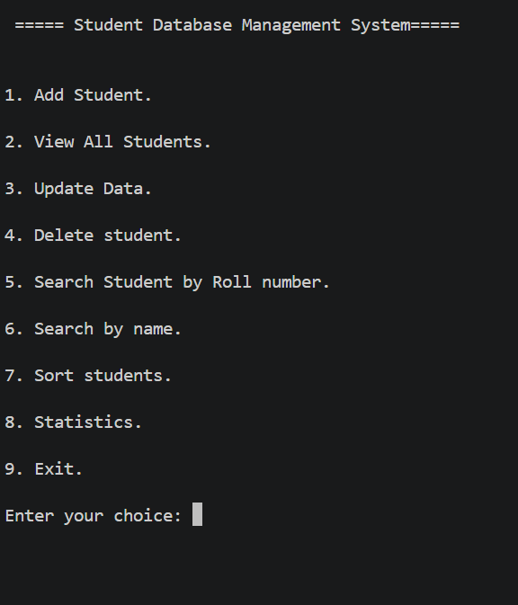
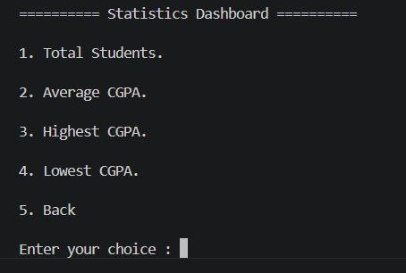
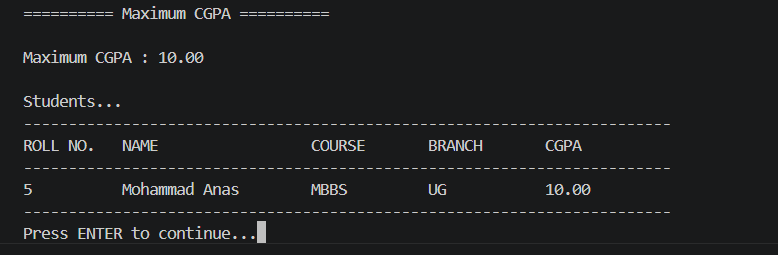
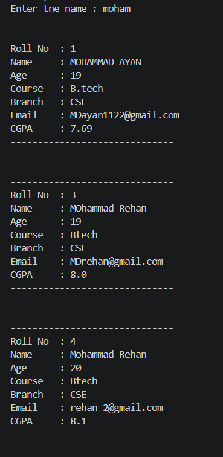
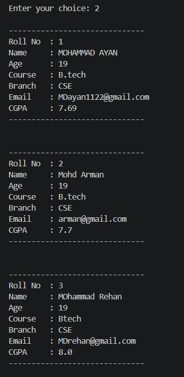

# 🎓 Student Database Management System

A **menu-driven Student Database Management System** built using **Python** and **SQLite3**. This project allows users to efficiently manage student records through a simple command-line interface while demonstrating CRUD operations, SQL queries, searching, sorting, and statistical analysis.

---

## ✨ Features

- ➕ Add a new student
- 📋 View all students
- 🔍 Search students by Roll Number
- 🔎 Search students by Name
- ✏️ Update student details
- 🗑️ Delete student records with confirmation
- 🔤 Sort students by Name (A–Z / Z–A)
- 📊 Sort students by CGPA (Highest / Lowest)
- 🔢 Sort students by Roll Number
- 📈 Statistics Dashboard
  - 👥 Total number of students
  - 🎓 Average CGPA
  - 🏆 Highest CGPA with student details
  - 📉 Lowest CGPA with student details
- 💾 Persistent data storage using SQLite3

---

## 📌 Highlights

- ✔ Built using **Python** and **SQLite3**
- ✔ Modular project structure
- ✔ Clean and reusable code
- ✔ Parameterized SQL queries for security
- ✔ Search, Sort, and Statistics Dashboard
- ✔ Git version controlled
- ✔ Beginner-friendly and easy to understand

---

## 🛠️ Technologies Used

- 🐍 Python 3
- 🗄️ SQLite3
- 💻 Visual Studio Code
- 🌱 Git
- 🐙 GitHub

---

## 📂 Project Structure

```text

Student-Database-Management-System/
│
├── screenshots/
│   ├── main_menu.png
│   ├── view_students.png
│   ├── statistics_dashboard.png
│   ├── highest_cgpa.png
│   └── search_by_name.png
│
├── student_menu.py
├── student_db.py
├── insert_student.py
├── view_student.py
├── lookup_student.py
├── update_student.py
├── delete_student.py
├── statistics.py
├── utils.py
├── collage.db
├── .gitignore
└── README.md
```

---

## 🚀 Getting Started

### 1️⃣ Clone the Repository

```bash
git clone https://github.com/mdayanakbar1144-creator/Student-Database-Management-System.git
```

### 2️⃣ Navigate to the Project Folder

```bash
cd Student-Database-Management-System
```

### 3️⃣ Run the Application

```bash
python student_menu.py
```

or

```bash
python3 student_menu.py
```
---

## 📊 Statistics Dashboard

The Statistics Dashboard provides quick insights into the student database.

- 👥 Total Students
- 🎓 Average CGPA
- 🏆 Highest CGPA
- 📉 Lowest CGPA
- 📋 Displays students having the highest or lowest CGPA

---
#  🎥Demo

[▶️ Click To watch  the Demo](screenshots/demo.mp4)

# 📸 Screenshots

## 📸 Main Menu



## 📊 Statistics Dashboard



## 🏆 Highest CGPA



##  🔍 Search by Name



## 📋 Student Records


---

## 🎯 Learning Outcomes

This project helped me learn and practice:

- Python Programming
- SQLite Database Management
- CRUD Operations
- SQL Queries
- Aggregate Functions (COUNT, AVG, MAX, MIN)
- Searching & Sorting Techniques
- Modular Programming
- Code Refactoring
- Git & GitHub Workflow
- Writing Clean and Maintainable Code

---

## 🔮 Future Improvements

- 📤 Export student records to CSV
- 📥 Import student records from CSV
- 📊 Data visualization and analytics
- 🔐 User authentication
- 🖥️ GUI version using Tkinter or PyQt
- 🌐 Web version using Flask or Django

---

## 👨‍💻 Author

**Mohd Ayan**

Computer Science Engineering Student

- GitHub: https://github.com/mdayanakbar1144-creator
- LinkedIn: https://www.linkedin.com/in/mohd-ayan-72b78a365/

---

## ⭐ If you found this project useful, consider giving it a star!